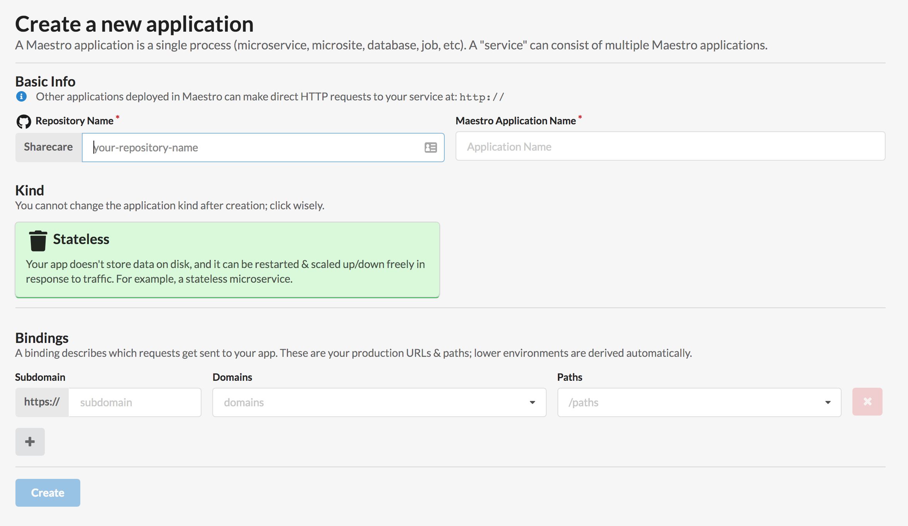
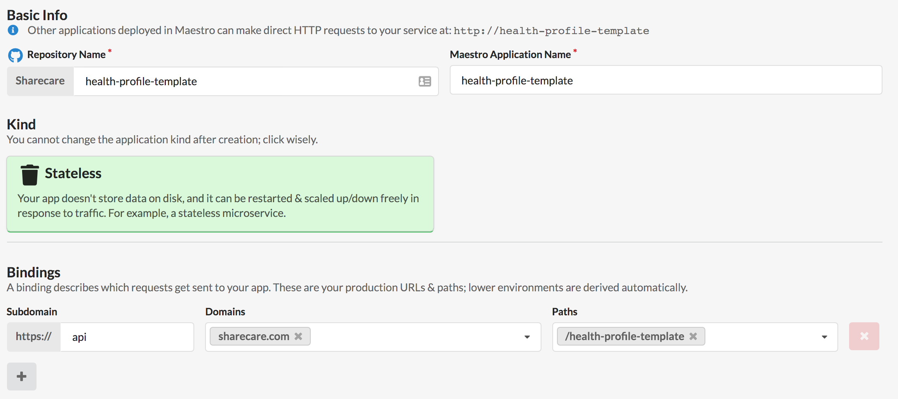
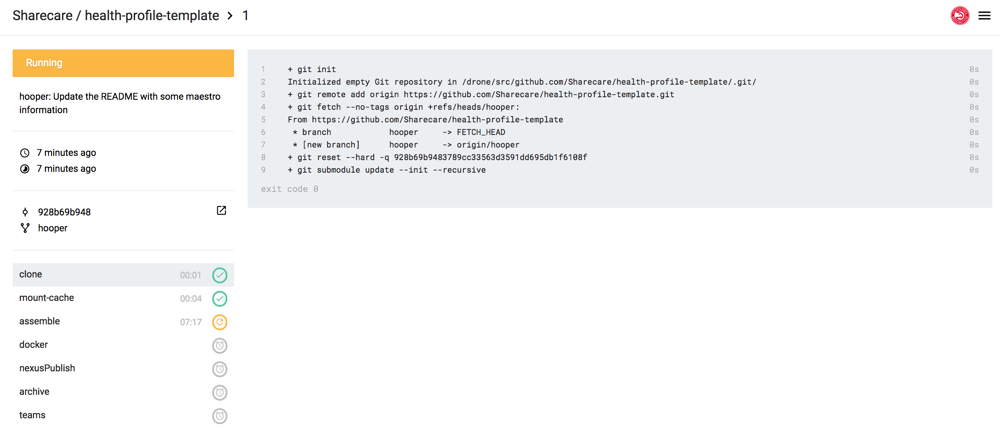
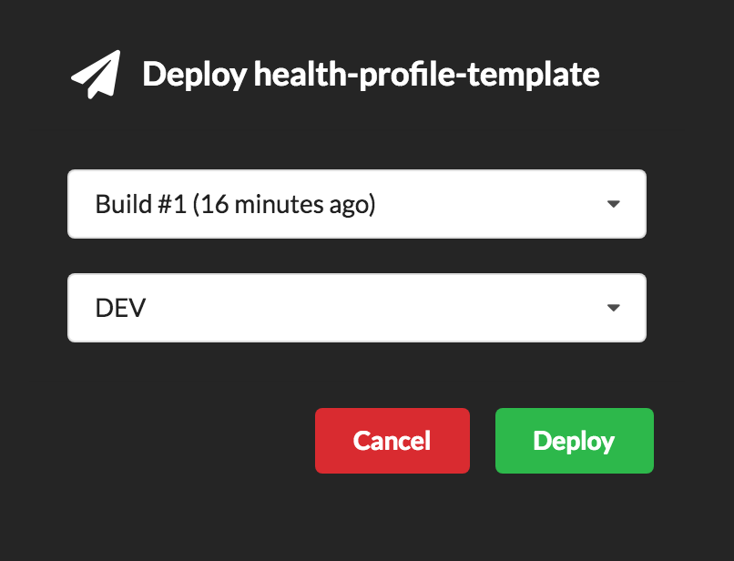
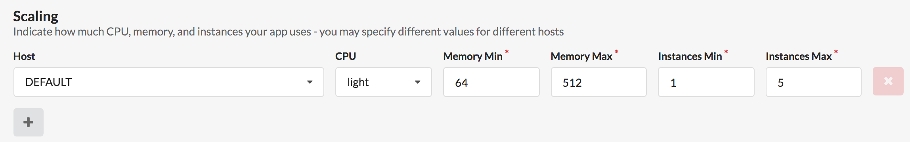
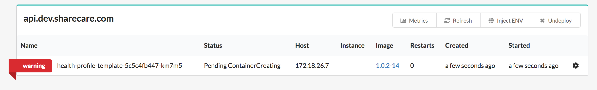

Scala Play Cloud Template
===============================

### Making this Your Own:

1. Change every `TODO`
1. Congratulations!

---

### Running Locally

#### TL;DR:

1. Run (and recompile on code change) with SBT `sbt clean run`
2. Run in Docker (no recompile) `./run-local.sh`
3. Coverage Report: `./coverage-report.sh`

#### 1. SBT

You can run this a handful of different ways. The easiest is to run yours outside of a container using `sbt clean run`. 
This is what IntelliJ uses. This should recompile on code change. If you want to update coverage each time it recompiles,
you'll need to runs something like `sbt "~;clean;coverage;test"` (this is basically what's contained in our `coverage-report` 
script).

#### 2. Docker

You can also run this through the `./run-local.sh` script, enabling you to simulate how this would run in one of our 
cloud environments. This requires [docker](https://docs.docker.com/docker-for-mac/install/) to be installed. If you're working on a Mac, you'll need `docker-machine` 
to be installed, and you might want to run `docker-machine start && eval $(docker-machine env)` in order to get your
environment variables set.

**If that still doesn't work, keep reading.**

You might also need to include a specific driver in order to get docker to work locally. I'd suggest taking a look at [this article](https://pewpewthespells.com/blog/setup_docker_on_mac.html).

**TL;DR (from that article):**

If you're using `brew`, here's a quick shortcut:

    brew install docker
    brew install docker-machine
    brew install docker-machine-driver-xhyve

Then you're going to want to create the default environment and specify the drive you just installed (`xhyve`).

	sudo chown root:wheel $(brew --prefix)/opt/docker-machine-driver-xhyve/bin/docker-machine-driver-xhyve
	sudo chmod u+s $(brew --prefix)/opt/docker-machine-driver-xhyve/bin/docker-machine-driver-xhyve
	docker-machine create --driver xhyve default
    eval $(docker-machine env default)
    
Now you should be able to use the `./run-local.sh` script.

**TIPS**:

1. Set up an alias in your `hosts` file to your `docker-machine` ip address. Example:
```
##
# Host Database
#
# localhost is used to configure the loopback interface
# when the system is booting.  Do not change this entry.
##
127.0.0.1	localhost
255.255.255.255	broadcasthost
::1             localhost


## Docker Alias
192.168.64.2 	docker
```

Then you can use the following request without having to memorize the IP address of `docker-machine`:

```
curl -X GET http://docker:9000/dhs-audience-service/healthcheck
```


#### 3. Coverage Reports


We use the [sbt-scoverage](https://github.com/scoverage/sbt-scoverage) plugin. 

You're going to want to have your code coverage up for all of the APIs that we move to production. This increases
code quality and catches problems faster. I highly recommend having a pre-push git hook that tests and runs coverage
for your code. Eventually, we'd like to have our requirements be ( > 95% ) for all files (and we _will_ scan for 
`// $COVERAGE-OFF$`!), so let's try and keep everything unit tested moving forward.

To generate (and open) a report, you can crack open the code in `./coverage-report.sh`. `sbt-scoverage` generates a report at:

```bash
./target/scala-{version}/scoverage-report/index.html
```

So we're going to call `open` on that command (questionable in Windows) after generating the report with 
`sbt clean coverage test coverageReport`. The clean ensures that the target file wipes phantom files and you _need_
to run coverage before you run `test` in order to wire everything up. 


**TL;DR**

```bash
sbt clean coverage test coverageReport && open ./target/scala-2.11/scoverage-report/index.html
```

to run continuously:

```bash
sbt "~;clean;coverage;test;coverageReport"
```

---

### Setting Up a New Project

#### I. [Creating a new Maestro Application](https://maestro.admin.sharecare.com)

1. Head over to [Maestro](https://maestro.admin.sharecare.com) and check the top-left pane. 
   You should see the **home icon** and "Maestro". 
   Next to it, you'll see __(+) New Application__. 
   Click that.
1. Take a second to review the fields. 
   For now we're just going to focus on the fields in **bold**.<sup>1</sup>
    1. **Repository Name (required)**
    1. **Maestro Application Name (required)**
    1. Kind 
    1. **Bindings** 
1. For the template project, we've set up the following: <sup>2</sup>
    1. **Repository Name:** `dhs-audience-service`
    1. **Maestro Application Name:** `dhs-audience-service`
    1. **Kind**: `Stateless`
    1. **Bindings**: 
        1. **Subdomain:** `api`
        1. **Domains:** `sharecare.com`
        1. **Paths:** `/dhs-audience-service`
        
#### II. [Monitoring Drone Builds](https://drone.admin.sharecare.com/Sharecare/dhs-audience-service)
  
  1. First things first, run `conf/build_deps_cache.sh` for your project. 
  This caches a ton of SBT dependencies and uses nexus to hold onto those. 
  If you haven't run this at least once for your project (or reconfigure to use the 
  shared project deps) your build will fail. 
  In case you were wondering, it happened to me (@thejaredhooper) -- 
  Check out [Build #1](https://drone.admin.sharecare.com/Sharecare/dhs-audience-service/1).
  1. After setting this up, you should see this project appear in 
  [Drone](https://drone.admin.sharecare.com/Sharecare/dhs-audience-service). 
  On the [repository list inside the Drone web console](https://drone.admin.sharecare.com/account/repos), the green "toggle" beside
  the repository name should be checked. 
  1. As soon as you push your first code changes, 
  you'll see a [build show up](./readme/drone-build-in-progress.png)<sup>3</sup>. 
  You can check the progress of the build and read logs from the drone web console. 
  - NOTE: You will see all of your build successes and failures in the channel 
  **Health Profile (UPP)** -> **Build Notifications** on Microsoft Teams.
  
#### III. [Deploying with Maestro](https://maestro.admin.sharecare.com)
  1. Let's deploy to **DEV**. A few things to note:
        1. Your configurations are going to be stored in the `conf` folder, and will correspond to each environment by name.
            - e.g. `api.dev.sharecare.com.conf` will apply to this deploy.
            - `api.sharecare.com.conf` will apply to production
            - `api.sharecare.com.br.conf` will apply to our Brazil site.
        1. Depending on the scaling settings set in the **Scaling** parameters in the 
        [Definition](https://maestro.admin.sharecare.com/manage/dhs-audience-service/definition) of the app<sup>5</sup>,
        you will see a different amount of containers on the screen.
  1. From here, you'll see that there is a `warning` flag across the container we just deployed<sup>6</sup>. That's fine.
  To understand _why_ that's fine, take a look at the `maestro.yaml` file and the parameters
  `initialDelaySeconds` for the `readinessProbe` and `livenessProbe`. These are the two delays that
  given to Kubernetes to tell it when to begin polling the microservice. This hits the `/healthcheck` endpoint
  to determine either. Since there's a delay, you'll see the **warning** for the duration of the `readingessProbe` delay.
  1. In **Postman** you should be able to hit the new microservice at `https://api.dev.sharecare.com/your-url/`. If you're deploying the template,
  you'll be able to hit it at `{{api_host}}/dhs-audience-service/1/hi` to receive the message "1:hi".
   

---

### Documentation

We use [Swagger]() for endpoint documentation, so you'll be expected to maintain that standard
for the public and internal APIs. 

The example controller provided in this template should suffice as an example, 
but otherwise, we'll go over expectations here.

#### Routes

- Every publicly accessible route should have docuentation. Use `### NoDocs ###` on endpoints
that are specifically for healthchecks, documentation and otherwise.

#### Models

- This should include all models defined and used as part of the endpoint. Since most of teh 
path variables are typically scalar, we'll expect you to provide a description and any
assumptions that the microservice makes. (For example, is `userId` being cast to a `UUID`?)

#### Responses

- At minimum, should cover a `200` response code.

---

### Code Quality

#### Code Coverage

```
./coverage-report.sh
```

---

### Source Control

#### Try and prefix commits with the branch that they're on.

```bash
git commit -m"hooper: Updated the README."
```

If you don't want to do that every time, try the following git hook.

- Prepending the branch on `prepare-commit-msg` <sup>[gist](https://gist.github.com/thejaredhooper/40ece8624ecbddb32b2dcf8e829a7193)</sup>

```bash
# ~/.githooks/prepare-commit-msg

if [ -z "$BRANCHES_TO_SKIP" ]; then
  BRANCHES_TO_SKIP=(master continuous dev test)
fi

BRANCH_NAME=$(git symbolic-ref --short HEAD)
BRANCH_NAME="${BRANCH_NAME##*/}"

BRANCH_EXCLUDED=$(printf "%s\n" "${BRANCHES_TO_SKIP[@]}" | grep -c "^$BRANCH_NAME$")
BRANCH_IN_COMMIT=$(grep -c "\[$BRANCH_NAME\]" $1)

if [ -n "$BRANCH_NAME" ] && ! [[ $BRANCH_EXCLUDED -eq 1 ]] && ! [[ $BRANCH_IN_COMMIT -ge 1 ]]; then 
  sed -i.bak -e "1s/^/$BRANCH_NAME: /" $1
fi
```

#### Try running tests _before_ pushing to source control.

If you don't want to do this manually, check out the following git hook:

- Running tests for an SBT project `pre-push` <sup>[gist](https://gist.github.com/thejaredhooper/e1af2f274889d9ec780dc86603150e6e)</sup>

```bash
# checks if locally staged changes pass tests.
echo "starting pre-push hook"

_DIR=$( cd "$( dirname "${BASH_SOURCE[0]}" )" && pwd )
DIR=$( echo $_DIR | sed 's/\/.git\/hooks$//' )

echo "Running pre-commit hook ... (you can omit this with --no-verify, but don't)"
git diff --quiet
hadNoNonStagedChanges=$?

if ! [ $hadNoNonStagedChanges -eq 0 ]
then
	echo "* Stashing non-staged changes"
	git stash --keep-index -u > /dev/null
fi


[ ! -f $DIR/build.sbt ]
sbtProject=$?

if [ ! sbtProject -eq 0 ]
then
    echo "* Not an SBT Project."
    exit 0
fi

echo "* This is an SBT project."
echo "* Running Tests."
sbt ";clean;test" > /dev/null
passes=$?

echo "* Compiles?"

if [ $passes -eq 0 ]
then
	echo "* Yes!"
else
	echo "* No!"
fi

if ! [ $hadNoNonStagedChanges -eq 0 ]
then
	echo "* Scheduling stash pop of previously stashed non-staged changes for 1 second after commit"
	sleep 1 && git stash pop --index > /dev/null & # sleep and & otherwise commit fails when this leads to a merge conflict
fi

if [ $passes -eq 0 ] 
then
	echo "... done. Proceeding with commit."
	exit 0
else
	echo "CANCELLING commit due to COMPILE or TEST ERROR."
	exit 2
fi
```

To skip the above hook, run `git push --no-verify`.

---


### Picture References

##### Notice: This was called "Health Profile Template" before being renamed.

1. **Maestro New Application Page**

    
    
1. **Maestro Configuration (for this template project)** -- the name/repository are not correct

    
    
1. **Drone Build in Progress**

    
    
1. **Maestro Deploy**

    
    
1. **Maestro Scaling Definition**

    
    
1. **Microservice "warning"**

    
    